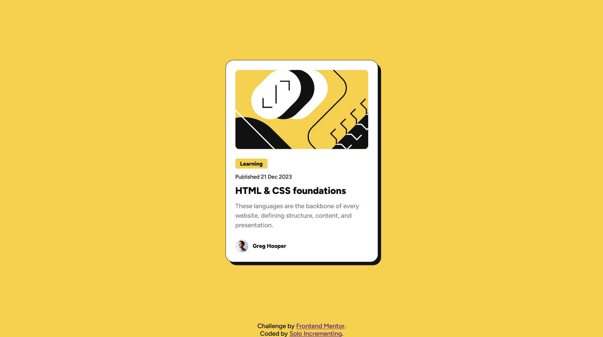

# Frontend Mentor - Blog preview card solution

This is a solution to the [Blog preview card challenge on Frontend Mentor](https://www.frontendmentor.io/challenges/blog-preview-card-ckPaj01IcS).

## Table of contents

- [Overview](#overview)
  - [Result](#result)
  - [Links](#links)
- [My process](#my-process)
  - [Workflow](#workflow)
  - [Built with](#built-with)
  - [What I learned](#what-i-learned)
- [Author](#author)

## Overview

### Result



### Links

- [Solution](https://www.frontendmentor.io/solutions/blog-preview-card-with-responsive-components-aIflixr2nX)
- [Live Site](https://solo-incrementing.github.io/blog-preview-card/)

## My process

### Workflow

- Write HTML first to create the structure that will be built upon.
- Style from lowest specificity to highest specficity of elements.
- Style structures such as flexboxes and grids.
- Compare with the initial design to locate discrepancies and resolve them.

### Built with

- Semantic HTML5 markup
- CSS custom properties
- Mobile-first workflow

### What I learned

The clamp css function combined with viewport width unit allows us to create responsive components without needing media queries

```css
.card {
	width: clamp(327px, 30vw, 384px);
}

.card-content__category {
	font-size: clamp(12px, 2vw, 14px);
}

.card-content__publish-date {
	font-size: clamp(12px, 2vw, 14px);
}

.card-content__title {
	font-size: clamp(20px, 2vw, 24px);
}

.card-content__description {
	font-size: clamp(14px, 2vw, 16px);
}
```

## Author

- Frontend Mentor - [@Solo-Incrementing](https://www.frontendmentor.io/profile/Solo-Incrementing)
- Github - [@Solo-Incrementing](https://github.com/Solo-Incrementing)
